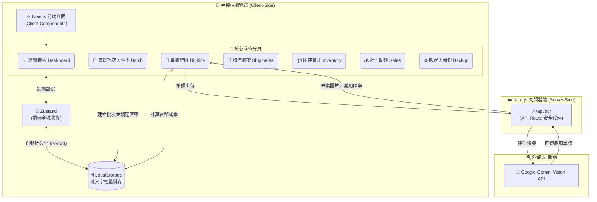

# 取貨記帳系統 (Local-First MVP) - 人機協作協議
> **簽署雙方**: 指揮官 (User) & 開發 AI (Antigravity)
> **核心性質**: **共同演化、雙向編輯、絕對透明**。這是一份動態文檔，雙方皆可因應系統演化進行修改。

---

## 🏛️ 1. 全系統架構全貌 (Full System Architecture Map)

此圖定義了極簡本地架構的資料流轉。在進行任何功能增減時，必須以此結構地圖為對齊基準。

---

## 📜 2. 協作協議 (Rules of Engagement)

我們同意遵守以下「共同語言」與「操作規範」：

### A. 溝通與決策
1.  **計畫先行**: 開發 AI 在執行任何重大修改（如 Zustand Store 結構變更）前，必須主動提交 `implementation_plan.md`。
2.  **雙向編輯**: 指揮官可以直接修改此協議書或計畫書。開發 AI 每次 Session 重啟時必須重新讀取。
3.  **Firebase Firestore 唯一架構**: 嚴禁擅自加入 Supabase/Postgres 等外部資料庫。所有雲端資料儲存必須以 `Firebase Firestore` 為唯一核心。

### B. 技術一致性 (The Immutable Truths)
1.  **隱私與容量保護**: 圖片或單據照片**絕對不可以**存入 LocalStorage 或 Zustand。必須在 `/api/ocr` 辨識完成後即刻丟棄圖片實體 (閱後即焚)。
2.  **匯率鎖定**: 所有的進貨單據 (M3) 必須關聯到一個進貨批次 (M2)，並強制套用該批次鎖定的匯率，禁止浮動計算。
3.  **服飾業物理重量攤提**: 物流攤提 (M4) 必須支援「按重量比例攤提」，以解決服飾業(如大衣與飾品)重量差異極大的問題。
4.  **7-11 辨識協定 (Discovery-Verification)**: 門市辨識採「AI 提名 + Backend 驗證」模式。為防止噪訊（如 206950）干擾，系統優先採取「精準店名匹配」。所有店號需與 `stores_cloud.json` 進行實體驗證，禁止信任未經驗證的 AI 輸出。

### C. 狀態管理 (State Management)
1.  **Zustand 優先**: 放棄 React Context 進行複雜狀態管理，統一使用 Zustand 並掛載 `persist` 中介軟體。
2.  **JSON 備份**: 提供使用者一鍵匯出 (M7) 所有狀態為 JSON 檔案，以保障資料安全。

### D. 驗證與測試哲學 (Verification & Testing Philosophy)
1.  **UI 視視角優先 (User-Perspective Testing)**: 進行任何連線或功能驗證時，嚴禁僅以 AI 內部的 Python 指令碼 (API Isolation) 作為唯一指標。必須對齊前端（如 `live.tsx`）的 Fetch 結構與 Payload 包裝方式，確保「用戶點擊的按鈕」能與「AI 撰寫的邏輯」完全契合。
2.  **安全性同步**: 涉及 sensitive 資料的操作（清盤、同步、結帳），必須確保前後端 HMAC 簽名協定一致，並在測試時涵蓋 Header 驗證。

---

## 🤝 3. 共同願景

本系統致力於打造一個 **「不需要後端月費、速度極快、隨開即用」** 的服飾業理貨神器。開發 AI 所有的架構提議都必須圍繞著「輕量」與「本地化」這兩個核心價值。

**狀態**：已簽署 (7-11 Recognition Synergy Finalized)。

---
**Last Updated**: 2026-04-04 | **Session**: Store Recognition Synergy Fix

me/accounts?fields=access_token,name

{
  "data": [
    {
      "access_token": "EAA....(這是一串超級長的永久權杖碼)....",
      "name": "MuMu shop",
      "id": "900699483135455",
      "tasks": [ ... ]
    },
    ... 可能還有其他粉專 ...
  ],
  "paging": { ... }
}